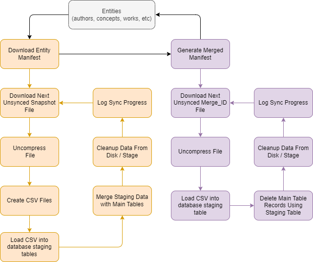

# Open Alex Snapshot Importer for CFML

**This is still a work in progress. More changes coming over the next few months**


 [OpenAlex](https://docs.openalex.org) is a fully open catalog of the global research system. Their dataset describes scholarly entities and how those entities are connected to each other. Types of entities include works, authors, sources, institutions, concepts, publishers, and funders.

 There are two ways to download OpenAlex data to your local environment. A REST api and data snapshot. This repository provides a way to download the [snapshot data](https://docs.openalex.org/download-all-data/openalex-snapshot). As they mention, downloading the whole snapshot is hard. There are 100s of millions of records and will require nearly 2TB of storage. The initial load can take a couple of days. Subsequent updates could take that long as well depending on how many updates are being made.

## Prerequisites
This script was developed in the following environment. With a few tweaks it could work on Linux and other databases. For performance reasons a lot of the SQL queries and csv file imports are tied closely to Oracle specific calls. 

* Windows OS with powershell (should always be installed)
* Oracle 19C+ server
* Oracle client ([example](https://www.oracle.com/database/technologies/oracle19c-windows-downloads.html)) installed on same machine as Coldfusion (including sqlldr utility). From a terminal make sure sqlldr loads the Oracle utility.
* Adobe Coldfusion 2021+. Lucee would probably work, but hasn't been tested.

## Getting Started
Assuming you meet all of the prerequisites there are few things you need to do to setup your environment. OpenAlex snapshots are open to the public in an [Amazon S3 Bucket](https://openalex.s3.amazonaws.com/browse.html). No special amazon account is necessary. I was able to download all of the files without need of the Amazon S3 CLI utility mentioned [here](https://docs.openalex.org/download-all-data/download-to-your-machine).

### Database
The first thing to do is make sure you have access to an Oracle server with enough resources to run this script. 

Create a new user named `openalex`. Next, you'll find the table creation script under `db\openalex-oracle-schema`. This was borrowed heavily from OpenAlex's [schema diagram](https://docs.openalex.org/download-all-data/upload-to-your-database/load-to-a-relational-database/postgres-schema-diagram). Make sure you plan your tablespaces and database setup with the space considerations in mind. There will be some tweaking involved most likely as you being running the script.

### Settings

In order to be as flexible as possible there are two variables that need to be set. Both point to the `settings.json` file that needs to be setup. Look at the root folder for the `settings.json.sample` file. You can copy this and move it into a location **outside of your web root!** and name it `settings.json`. This is very important as if you leave it in a folder accessible to the internet someone could load your password information.

```json
{
  "environment": "local",
  "database": {
    "local": {
      "datasource": "datasourcename",
      "schema": "openalex",
      "connectionstring": "openalex/\"password\"@oracleInstance"
    },
    ...
  }
}
```

#### Application.cfc
Look for the /settings.json assignment under`this.mappings`. Update the relative path to settings.json after (getDirectoryFromPath(getCurrentTemplatePath()). This step will configure Coldfusion to get the correct settings.

```
this.mappings = {
    "/settings.json": (getDirectoryFromPath(getCurrentTemplatePath()) & "../../../../path/to/settings.json")
  };
```  

#### Powershell
Under `files\loader\settings.ps1` set the $settingsPath variable to point to the settings.json file relative to this folder. This is one extra step, but allows you to run the entity loader scripts (e.g. \loader\authors\run.ps1) outside of Coldfusion, mainly for testing purposes.

```
$settingsPath = "..\..\..\..\..\..\..\path\to\settings.json"
```

### Coldfusion

[Commandbox](https://www.ortussolutions.com/products/commandbox#overview) is a great way to run Coldfusion for a project like this, if you don't already have a Coldfusion application server.

As long as you configured everything in the settings section you should be mostly set. Make sure you have a datasource set in the Coldfusion Administrator and then it's added to the `settings.json` file. Also make sure the Oracle package is installed. No AWS package is necessary to setup, even though we are loading files from a S3 bucket.

## Directory Structure
Some information left out. Just highlighting some important areas.

```
root/
├── Application.cfc (need to set settings.json location)
├── OpenAlexClient.cfc
├── run.cfm (where to run the script. Run in web browser.)
├── settings.json.sample (move this outside outside webroot and rename to settings.json)
├── db/
│    └── oracle-schema.json (setup tables)    
└── files/
    │── compressed (temp location for snapshot files)
    │── loader/
    │   │── authors
    │   │   └── csv (generated csv files to pass to sqlldr)
    │   │   └── logs (oracle sqlldr logs. Review for errors)
    │   │   └── [control files].ctl
    │   │   └── run.ps1 (calls sqlldr. This is called in Coldfusion.)
    │   │── concepts
    │   │── etc
    │   └── settings.ps1 (Need to set the $settingsPath to point to the settings.json file)
    │── manifest (where manifests are downloaded or created)
    │    │── authors_merged.json
    │    │── authors.json
    │    └── etc
    └── uncompressed (temp location for uncompressed files)
```

## Running the Script

Assuming that this repository was extracted to the root of your web server under a folder called openalex and you are running on localhost, you could point your browser to `http://localhost\openalex\run.cfm`. Adjust accordingly for your environment. `run.cfm` calls the `OpenAlexClient` and passes in what entities you want to sync. Adjust to your needs.

```js
api = new OpenAlexClient();
api.main(
  syncAuthors = true,
  syncConcepts = true,
  syncFunders = true,
  syncInstitutions = true,
  syncPublishers = true,
  syncSources = true,
  syncWorks = true
);
```

Output is logged to the screen as it progresses. Again, this could take quite a while depending on what entities are being synced. Think days possibly. If output isn't being updated as the script progresses check your settings to make sure cfflush is working. If you are running IIS web server in front of Coldfusion make sure the `is_buffer_enable` is set to false in `{cfroot}\config\wsconfig\1\isapi_redirect.properties`.

# How it works

## Overview


## Entity inserts\updates
The script is essentially syncing data with the OpenAlex [S3 bucket](https://openalex.s3.amazonaws.com/browse.html#data/). The script traverses each entity (e.g. works, sources, publisher, etc.) and first downloads the manifest file, which gives us all snapshot files that need to be downloaded. It then checks the `ENTITYLATESTSYNC` table to see if there's any previous sync records. If so, it'll resume from that point forward. If you ever want to start over, you can clear this table's information.

The script will then loop over all the snapshots and process the data. It downloads the snapshot file to the `compressed` folder. An individual compressed file shouldn't be larger than 2GB. It'll then `uncompress` it to the uncompressed folder. From there we loop over all records and generate the appropriate csv files needed to populate the database. The csv files are stored in the `loader\[entity]\csv` folder.

Sqlldr will then be called to import all the csv files into the appropriate staging tables. Once that is complete the staging tables will be merged with their actual main tables. Finally the staging tables will be truncated and the snapshot and csv files will be deleted. After this process is successful the result wil be logged to `ENTITYLATESTSYNC`. The loop will then start over with the next snapshot file.

## Entity Deletions using Merge_ids
After the entities have been synced there's one final step. We have to process the [Merged Entities](https://docs.openalex.org/download-all-data/snapshot-data-format#merged-entities). Basically, it's just an ID that has been merged with another ID, affectively deleting it. Think two author records that are actually the same person. Unfortunately there's no manifest file for this section, so I ended up generating one to help processing of the files. 

These files are processed in a very similar fashion to the entity snapshots. The compressed file is first downloaded, then uncompressed, and then loaded into a staging table named `STAGE$MERGEIDS`. Then a delete query is performed on the appropriate tables based on the IDs in this table. Initially I didn't use sqlldr to load these IDs, but after seeing a file with close to 10 million merged records, I thought it best for performance reasons. When a successful merge record has been processed it is recorded in the `ENTITYMERGELATESTSYNC` table.

# Debugging / Performance Tweaks

There are always tradeoffs when working with such a large dataset. I mostly focused on minimizing the needed resources. The script downloads one snapshot file at a time and processes it, instead of all of them at once and then processes it. This reduces the disk space needed on the server and in Oracle. I haven't tested the second approach to see if it would speed up the syncing of data.

## Coldfusion settings
* 